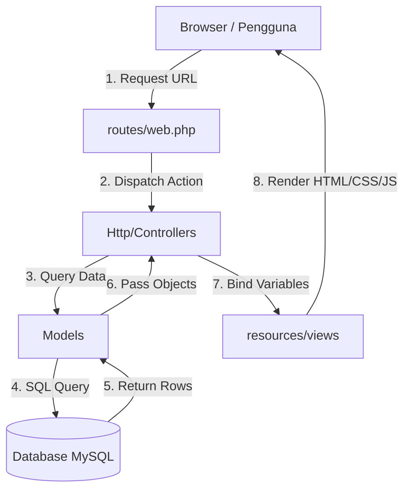
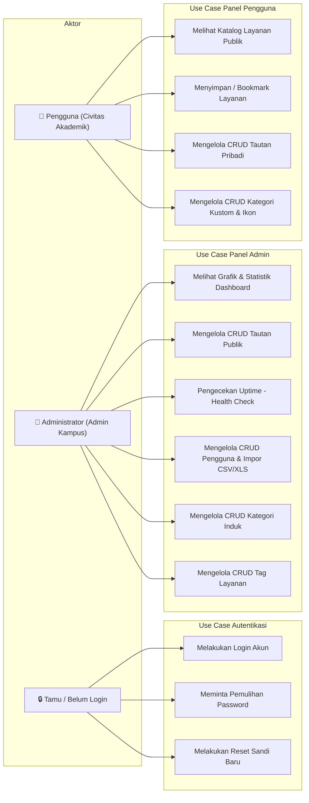
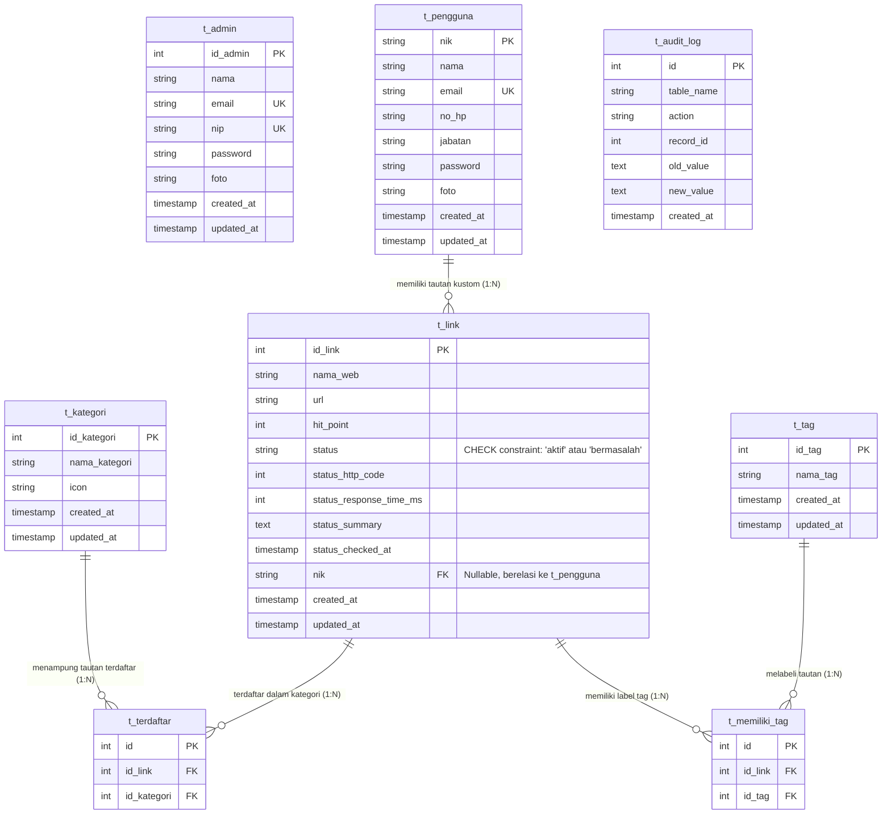

# Penjelasan Alur Kerja Fungsi Sistem POLTREE (MVC & Routing)

Dokumen ini menjelaskan secara komprehensif alur kerja, hubungan komponen **Model-View-Controller (MVC)**, serta mekanisme **Routing** pada proyek **POLTREE (Portal Link Terintegrasi)**.

---

## 🗺️ 1. Peta Routing Sistem (`routes/web.php`)

Rute aplikasi dibagi menjadi tiga kelompok utama berdasarkan tingkat otorisasi (Middleware):

### A. Rute Publik & Tamu (Guest Middleware)
*Hanya dapat diakses oleh pengguna yang belum login.*
* **`/login` [GET/POST]:** Menampilkan halaman login dan memproses otentikasi.
* **`/forgot-password` [GET/POST]:** Meminta tautan pemulihan sandi.
* **`/reset-password/{token}` [GET]** & **`/reset-password` [POST]:** Memproses atur ulang kata sandi baru.

### B. Rute Pengguna (Auth Pengguna Middleware)
*Hanya diakses oleh Pengguna/Civitas Akademik dengan Guard `pengguna`.*
* **`/dashboard` [GET]:** Halaman utama portal layanan personal.
* **`/pengguna/links` [POST/PUT/DELETE]:** Pengelolaan CRUD tautan kustom milik pribadi.
* **`/pengguna/categories` [POST/PUT/DELETE]:** Pengelolaan CRUD kategori buatan sendiri beserta pemilihan ikon.
* **`/pengguna/profile` [POST] & `/pengguna/password` [PUT]:** Pembaruan profil dan sandi pengguna.

### C. Rute Administrator (Auth Admin Middleware)
*Hanya diakses oleh Admin Kampus dengan Guard `admin`.*
* **`/admin/dashboard` [GET]:** Panel statistik utama, status uptime, dan grafik aktivitas sistem.
* **`/admin/services` [GET]:** Katalog seluruh layanan utama sistem.
* **`/admin/links` [GET/POST/PUT/DELETE]:** CRUD kelola tautan publik terintegrasi.
* **`/admin/links/check` [POST]:** Memulai pengecekan massal kesehatan tautan (*Health check API*).
* **`/admin/users` [GET/POST/PUT/DELETE]:** CRUD kelola civitas dan impor data massal.
* **`/admin/categories` [GET/POST/PUT/DELETE]:** CRUD kategori induk layanan.
* **`/admin/tags` [GET/POST/PUT/DELETE]:** CRUD label/tag layanan.

---

## 🏗️ 2. Hubungan Komponen MVC (Model-View-Controller)

Aplikasi POLTREE dibangun dengan pola arsitektur **MVC** yang memisahkan tanggung jawab data, visualisasi, dan logika bisnis:

---

## 🎭 3. Diagram Use Case & Relasi Database (ERD)

### A. Diagram Use Case Sistem
Diagram use case berikut memetakan interaksi dari dua aktor utama sistem POLTREE (Administrator dan Pengguna/Civitas):

### B. Diagram Relasi Entitas Basis Data (ERD)
POLTREE memiliki database relational yang kokoh dengan skema relasi antar tabel sebagai berikut:

---

## 🔍 4. Penjelasan Alur Kerja Per Modul

### 🔐 A. Modul Autentikasi & Reset Password
* **Controller:** `App\Http\Controllers\Auth\LoginController`
* **Model Terlibat:** `App\Models\Admin` (tabel `t_admin`) dan `App\Models\Pengguna` (tabel `t_pengguna`).
* **Views:** `auth.login`, `auth.forgot-password`, dan `auth.reset-password`.

#### Alur Kerja Login Multi-Guard:
1. **Request:** Pengguna mengirimkan NIP/NIK dan Kata Sandi melalui form login.
2. **Controller Logic (`store`):**
   * Pertama, sistem mencoba melakukan autentikasi sebagai **Admin** menggunakan Guard `admin` dengan NIP sebagai kunci identitas.
   * Jika gagal, sistem mencoba autentikasi sebagai **Pengguna** menggunakan Guard `pengguna` dengan NIK sebagai kunci identitas.
3. **Response:** Jika salah satu berhasil, sesi dibuat dan pengguna diarahkan ke dashboard masing-masing. Jika keduanya gagal, dilempar kembali dengan pesan galat.

#### Alur Kerja Lupa Password:
1. **Form Input:** Pengguna memasukkan Email/NIK terdaftar di halaman lupa sandi.
2. **Verifikasi Kontroler (`handleForgotPassword`):**
   * Mencari kecocokan data di tabel `t_admin` dan `t_pengguna`.
   * Menghasilkan token pemulihan unik berdurasi terbatas.
   * **Local Dev Mode:** Alih-alih mengirim email SMTP nyata, sistem memancarkan token langsung pada sesi sebagai pop-up interaktif agar pengembang dapat langsung melakukan pengujian reset instan secara lokal.
3. **Reset Kata Sandi (`handleResetPassword`):** Pengguna diarahkan ke form kata sandi baru. Setelah divalidasi, password baru di-hash menggunakan `Hash::make()` dan disimpan langsung ke database.

---

### 👤 B. Dashboard Pengguna (Civitas Portal)
* **Controller:** `App\Http\Controllers\Pengguna\DashboardController`
* **Model Terlibat:** `Pengguna`, `Kategori`, `Link`, `Tag`.
* **Views:** `dashboard.pengguna.index`

#### Alur Kerja Pengelolaan Link Personal:
1. **Mengambil Data (`pengguna`):**
   * Mengambil tautan publik yang disediakan admin.
   * Mengambil tautan pribadi milik pengguna tersebut (`where('nik', $user->nik)`).
   * Mengelompokkan berdasarkan kategori dan menyajikannya dalam tab navigasi responsif.
2. **Simpan Link Baru (`storeUserLink`):**
   * Menerima input nama website, URL, kategori, dan deskripsi dari form modal.
   * Melakukan validasi URL, menyimpan ke tabel `t_link` dengan mengaitkan NIK pemilik, serta menambahkan relasi kategori pada tabel `t_terdaftar`.
3. **Manajemen Kategori Kustom (`storeUserCategory`):**
   * Pengguna dapat membuat kategori personal baru. 
   * Memilih ikon kustom premium (disimpan dalam kolom `icon` di tabel `t_kategori`).

---

### 👑 C. Dashboard & Panel Administrator
* **Controller:** 
  * `App\Http\Controllers\Admin\DashboardController`
  * `App\Http\Controllers\Admin\LinkController`
  * `App\Http\Controllers\Admin\UserController`
* **Model Terlibat:** `Admin`, `Pengguna`, `Link`, `Kategori`, `Tag`.
* **Views:** `dashboard.admin.index`, `dashboard.admin.links`, `dashboard.admin.users`.

#### Alur Kerja Stored Procedure & Function di Dashboard:
1. **Load Dashboard (`admin`):**
   * Controller memanggil **Stored Procedure** database `sp_get_dashboard_statistics` menggunakan perintah `DB::statement()`.
   * Prosedur ini mengembalikan empat nilai *output parameters* sekaligus: Total Layanan, Layanan Aman, Rata-rata Waktu Respon, dan Kategori Teraktif Utama (dihitung berbasis subquery relasi terbanyak).
   * Controller memanggil **Stored Function** `sf_get_category_link_count(id_kategori)` di dalam query select untuk menyajikan jumlah tautan di masing-masing kategori teraktif secara instan.
2. **Response:** Nilai-nilai ini langsung di-render pada widget visual premium dan grafik status kesehatan layanan di halaman admin index.

#### Alur Kerja Pemantauan Kesehatan Layanan (Health Check API):
1. **Trigger Aksi (`checkAllLinks`):** Admin mengklik tombol "Periksa Status Semua Layanan".
2. **Service Dispatcher (`LinkStatusChecker`):**
   * Sistem mengambil semua tautan publik dari database.
   * Mengirim permintaan `GET` secara bergantian ke API eksternal **Downtime Check**: `https://downtimecheck.vercel.app/api/check?url={normalized_url}`.
   * API mengembalikan status apakah website *online*, waktu respon dalam milidetik, dan kode respons HTTP.
3. **Penyimpanan & Update Data:**
   * Informasi disimpan kembali ke baris tabel `t_link` masing-masing (`status_link`, `status_http_code`, `status_response_time_ms`, `status_summary`).
   * **Database Trigger Active:** Saat data tautan diperbarui dari controller, database secara otomatis mengaktifkan trigger `trg_after_link_update` untuk menulis riwayat perubahan nilai lama dan nilai baru ke dalam tabel log audit (`t_audit_log`).
4. **Tampilan Selesai:** Sesi sukses diflash ke halaman admin, memperbarui grafik status online/downtime secara real-time.

---

### 📂 D. Kelola Pengguna & Impor Massal
* **Controller:** `App\Http\Controllers\Admin\UserController`
* **Model Terlibat:** `Pengguna` (tabel `t_pengguna`).
* **Views:** `dashboard.admin.users`

#### Alur Kerja Impor Data CSV/XLS:
1. **Upload File (`importUsers`):** Administrator mengunggah berkas template data pengguna (format spreadsheet seperti `.csv` atau `.xlsx`).
2. **Parsing & Validasi:**
   * Sistem membaca setiap baris data pengguna (NIK, Nama, Email, No. HP, Jabatan).
   * Memastikan NIK bersifat unik dan tidak duplikat di database.
3. **Bulk Store:** Membuat baris data pengguna baru di tabel `t_pengguna` dengan password default terenkripsi bcrypt (`Hash::make('password_default')`).

---

## 🛠️ 5. Ringkasan Hubungan Antar Berkas

| Fitur | Route (R) | Controller (C) | Model (M) | View (V) |
|---|---|---|---|---|
| **Login Multi-Guard** | `/login` | `LoginController@store` | `Admin`, `Pengguna` | `auth.login` |
| **Lupa Password** | `/forgot-password` | `LoginController@handleForgotPassword` | `Admin`, `Pengguna` | `auth.forgot-password` |
| **Uptime Health Check** | `/admin/links/check` | `LinkController@checkAllLinks` | `Link` | `dashboard.admin.links` |
| **Statistik Stored Proc** | `/admin/dashboard` | `DashboardController@admin` | `Kategori`, `Link` | `dashboard.admin.index` |
| **Link Kustom Pribadi** | `/pengguna/links` | `DashboardController@storeUserLink` | `Link`, `Kategori` | `dashboard.pengguna.index` |
| **Impor Civitas Massal** | `/admin/users/import` | `UserController@importUsers` | `Pengguna` | `dashboard.admin.users` |

---
*Dokumen ini disusun untuk memudahkan pengembang memahami peta aliran data, interaksi antar komponen MVC, serta eksekusi query basis data lanjutan pada sistem POLTREE.*
